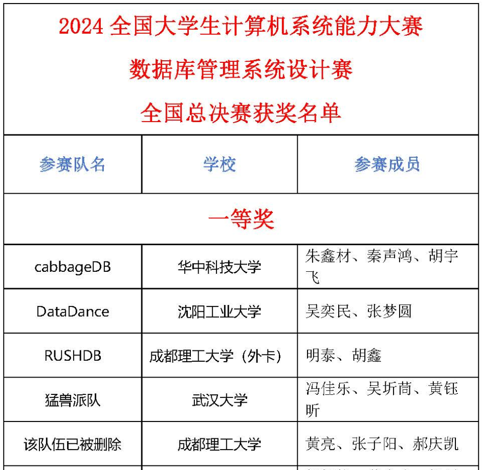

# 开源声明

## 版权与授权
1. **双源许可声明**  
   本仓库包含两部分代码：
   - 人民大学团队开发的 RMDB 基础框架（遵循 [木兰宽松许可证第2版](https://license.coscl.org.cn/MulanPSL2)）
   - RushDB 团队竞赛开发代码（© 2024 RushDB 实验室，额外适用以下竞赛特别条款）

2. **竞赛使用限制**  
   依据“系统能力大赛-数据库管理系统设计赛”大赛官方规则：
   > "参赛作品必须为团队原创，参考开源代码需显著声明并保持技术可追溯性"
   - 禁止直接提交本仓库代码或关键模块（如存储引擎/优化器实现）作为参赛作品
   - 允许参考架构设计文档（需注明出处）
   - 允许复用基础工具类代码（需修改代码指纹）

## 防抄袭措施
1. **技术标识**
   - 关键算法植入版本水印
   - 数据库元数据包含构建机器指纹
   - 性能测试模块内嵌隐蔽校验逻辑

2. **追责机制**  
   大赛技术委员会已备案本仓库：
   - 代码相似度检测阈值 ≥30% 将触发人工复核
   - 可通过 `strings` 命令提取的开发者签名验证代码来源

## 免责声明
1. **责任边界**  
   本仓库维护者不承担：
   - 因违规参赛导致的学术处分
   - 基于旧版本代码的兼容性问题
   - 企业级环境下的数据安全风险

2. **赞助商声明**  
   [RushDB 实验室](https://github.com/RushDB-Lab) 仅提供品牌支持：
   - 未参与具体代码开发
   - 不担保系统稳定性
   - 商业场景使用需另行授权

## 合理使用指引
✅ 允许行为：
- Fork 仓库进行学习研究
- 引用设计文档（需显式标注）
- 二次开发非竞赛用途系统

❌ 禁止行为：
- 删除代码版权注释
- 伪装原创提交竞赛
- 商业用途未授权分发

---

## 作品简介

队伍学校：成都理工大学

队伍名称：RushDB

队伍成员：明泰，胡鑫

TPC-C 测试结果：**32,820** txns/min

---

## RMDB

 

全国大学生计算机系统能力大赛数据库管理系统赛道，以培养学生“数据库管理系统内核实现”能力为目标。本次比赛为参赛队伍提供数据库管理系统代码框架 RMDB，参赛队伍在 RMDB 的基础上，设计和实现一个完整的关系型数据库管理系统，该系统要求具备运行 TPC-C 基准测试（TPC-C 是一个面向联机事务处理的测试基准）常用负载的能力。

RMDB 由中国人民大学数据库教学团队开发，同时得到教育部-华为”智能基座”项目的支持，平台、赛题和测试用例等得到了全国大学生计算机系统能力大赛数据库管理系统赛道技术委员会的支持和审核。系统能力大赛专家组和[101 计划数据库系统课程](http://101.pku.edu.cn/courseDetails?id=DC767C683D697417E0555943CA7634DE)工作组给予了指导。

## 实验环境：

- 操作系统：Ubuntu 18.04 及以上(64 位)
- 编译器：GCC
- 编程语言：C++17
- 管理工具：cmake
- 推荐编辑器：VScode

### 依赖环境库配置：

- gcc 7.1 及以上版本（要求完全支持 C++17）
- cmake 3.16 及以上版本
- flex
- bison
- readline

欲查看有关依赖运行库和编译工具的更多信息，以及如何运行的说明，请查阅[RMDB 使用文档](RMDB使用文档.pdf)

欲了解如何在非 Linux 系统 PC 上部署实验环境的指导，请查阅[RMDB 环境配置文档](RMDB环境配置文档.pdf)

### 项目说明文档

- [RMDB 环境配置文档](RMDB环境配置文档.pdf)
- [RMDB 使用文档](RMDB使用文档.pdf)
- [RMDB 项目结构](RMDB项目结构.pdf)
- [测试说明文档](测试说明文档.pdf)

## 推荐参考资料

- [**Database System Concepts** (**_Seventh Edition_**)](https://db-book.com/)
- [PostgreSQL 数据库内核分析](https://book.douban.com/subject/6971366//)
- [数据库系统实现](https://book.douban.com/subject/4838430/)
- [数据库系统概论(第 5 版)](http://chinadb.ruc.edu.cn/second/url/2)

## License

RMDB 采用[木兰宽松许可证，第 2 版](https://license.coscl.org.cn/MulanPSL2)，可以自由拷贝和使用源码, 当做修改或分发时, 请遵守[木兰宽松许可证，第 2 版](https://license.coscl.org.cn/MulanPSL2).

